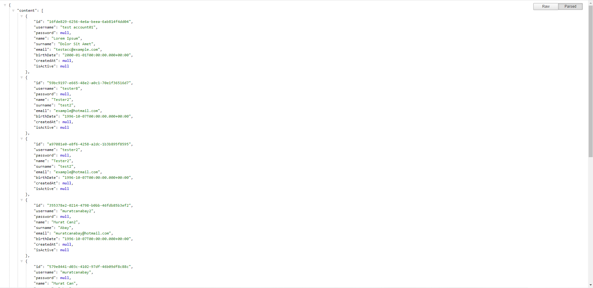

## Prerequisites

- Java 11

- Docker

## Installation

Run in the directory **/spring-cloud-app/doc/docker** the **docker-compose.yml** file is located.

```
docker-compose -f docker-compose.yml up -d
```

Create a keyspace named "**account**".

```cassandraql
create keyspace account with replication = {'class': 'SimpleStrategy', 'replication_factor': 1};
```

Create a schema name "**ticket**".
```mysql
create database ticket;
```
## Run

Run microservices in the following order below:
1. config-server
2. eureka-server
3. other services

Note: Be sure docker containers are running and complete installation step.

## Addresses

Eureka Server - http://localhost:8500


Account Service - http://localhost:8501


Ticket Service http://localhost:8502


Notification Service - http://localhost:8503

Api Gateway - http://localhost:8504

Admin Server - http://localhost:8505
- Applications - http://localhost:8505/applications


- Wallboard - http://localhost:8505/wallboard


Config Server - http://localhost:8888

Zipkin Server - http://localhost:9411


Hystrix Dashboard - http://localhost:8080/hystrix


Listen Hystrix Stream - Monitor Gateway http://localhost:8504/actuator/hystrix.stream


ElasticSearch - http://localhost:9200

I used elasticsearch tool box to monitor data.


RabbitMQ - http://localhost:15672

username: **rabbitmq**<br>
password: **rabbitmq**


MySQL - http://localhost:3306 

I used IntelliJ Database Plugin to monitor data.


Cassandra - http://localhost:9042

I used IntelliJ Database Plugin to monitor data.


## License
* [MIT](https://choosealicense.com/licenses/mit/)